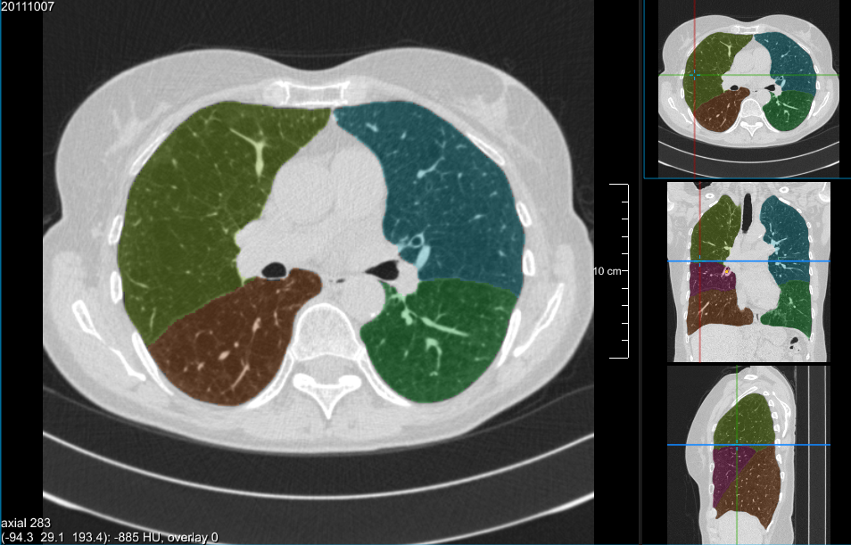
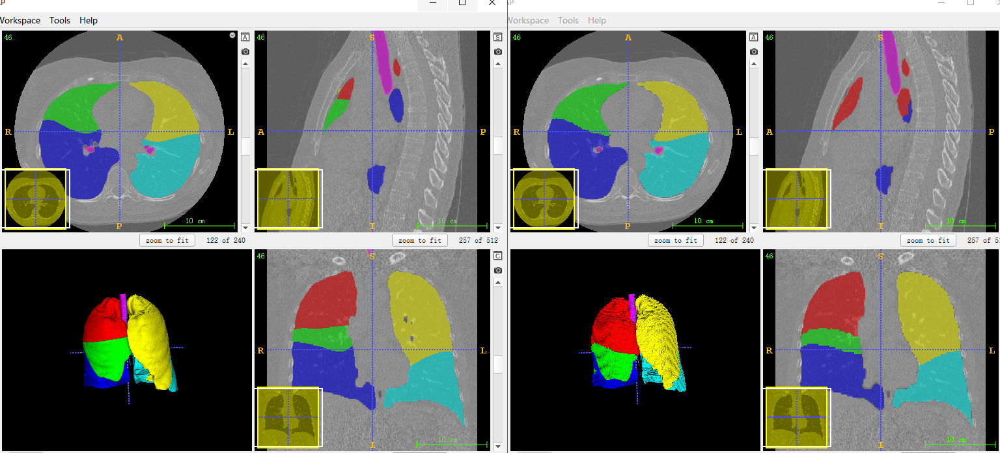
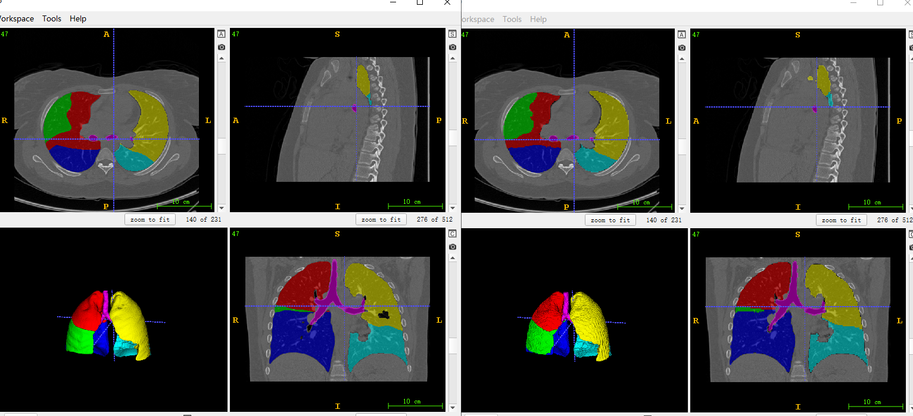
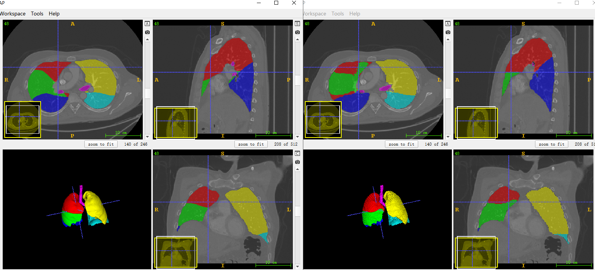
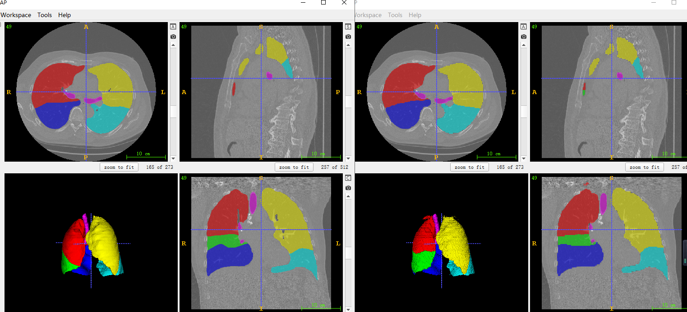
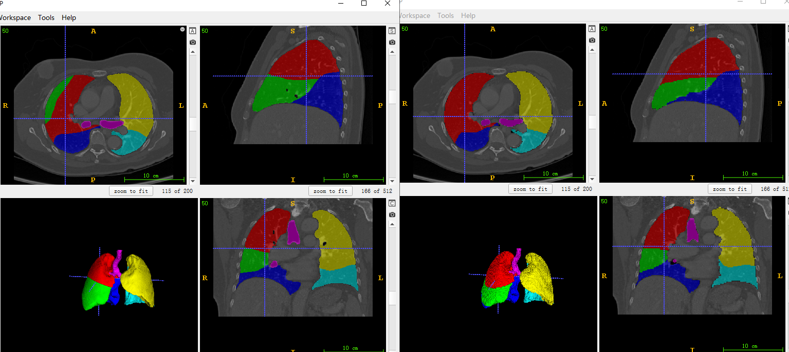

# Lung Lobe Segmentation Challenge Using Deep Learning
> This is an example of the CT imaging is used to segment Lung Lobe.

## Prerequisities
The following dependencies are needed:
- numpy >= 1.11.1
- SimpleITK >=1.0.1
- tensorflow-gpu ==1.14.0
- pandas >=0.20.1
- scikit-learn >= 0.17.1

## How to Use

**1、Preprocess**
* download CT Lung Lobe data:https://github.com/deep-voxel/automatic_pulmonary_lobe_segmentation_using_deep_learning
* generate patch(144,112,112) image and mask image:run the data3dprepare.py

**2、Lung Lobe Segmentation**
* the Vnet3d model can find here:https://github.com/junqiangchen/VNetFamily
* train and predict in the script of train.py and inference.py

## Result

* train loss and train accuracy
![loss.PNG]
![accuracy.PNG]

* test dataset segmentation result：left is groundtruth,right is predict

## Contact
* https://github.com/junqiangchen
* email: 1207173174@qq.com
* Contact: junqiangChen
* WeChat Number: 1207173174
* WeChat Public number: 最新医学影像技术
